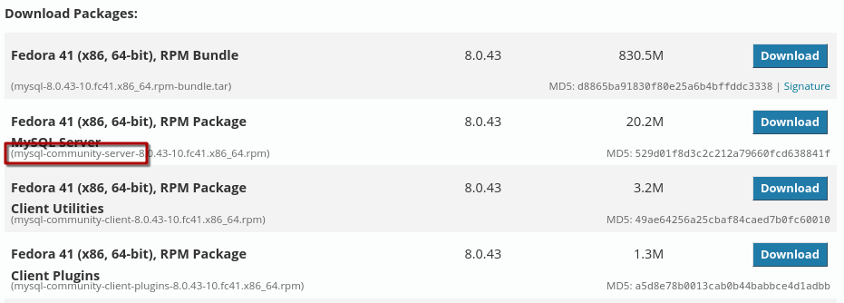
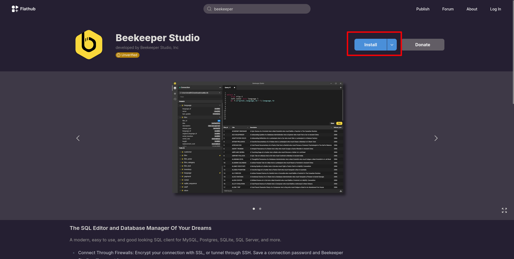
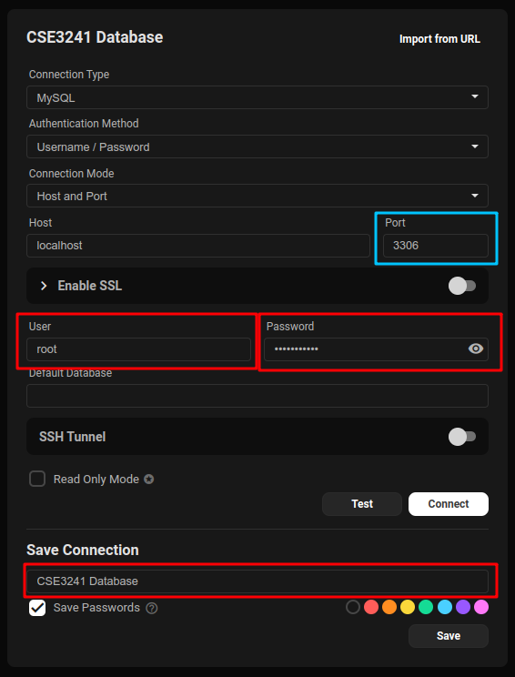
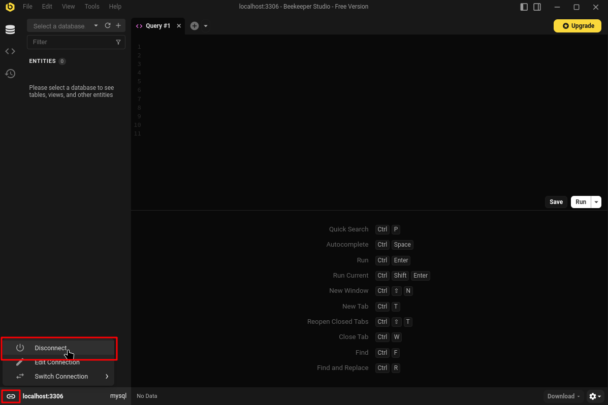

# Installing and working with MySQL on Linux

This guide serves as a how-to on getting a functional MySQL environment for the CSE3241
course at the Ohio State University. If you, as a Linux user, find places where the guide
can be improved, please make changes as you deem fit and add your name to the list of
authors. Be sure to abide by the license information at the end if you redistribute any
of your changes, such as sharing it with your professor.

## 1. Getting MySQL Community Server 8.0.43 installed

The specific details for how to install the community MySQL server will largely depend on
your Linux distribution (Ubuntu, Fedora, etc.) However, you have a few overall options:

### Option 1: Install from a downloaded package file

Go to [the official MySQL Community download page.](https://dev.mysql.com/downloads/mysql/)
Select `8.0.43` from the 'Select Version' dropdown. Select your Linux distribution from
the 'Select Operating System' dropdown. If applicable, you can select your specific
distribution version from the 'Select OS Version' dropdown, as well (e.g. Ubuntu 22.04,
Fedora 42, etc).

You'll see a variety of options. Select the 'Download' button for the relevant option
with a filename matching `mysql-community-server_8.0.43`

Once it's been downloaded to your system, there are a number of ways you can install the
package. Most modern distributions support local installations through their associated
app centers (GNOME Software, KDE Discover, Ubuntu App Store, etc.), but you can use the
package manager associated with your system if you want to keep an easily-accessible
history in case something goes awry (`apt`, `dnf`, etc.).




### Option 2: Install from your distribution repository

Most relatively-modern package managers (Fedora DNF, Nix, etc.) will have the required
MySQL packages in their repos. Because of the nature of Linux package managers and their
underlying "free software" ideology, this will already be the Community version. The
specifics will be different for each distribution, but on Fedora, it'll look something
like this:

```bash
$ sudo dnf install mysql-server
```

---

Regardless of how you choose to install, you can ensure MySQL is present on your system
by checking for it's version. The output should be something like this:

```bash
$ mysql -V
mysql  Ver 8.0.42 for Linux on x86_64 #(Source distribution)
```

## 2. Configuring MySQL

### Enabling the server through a `systemd` service

Once you have MySQL installed, it should come with a service that you can enable. **This
assumes you use a `systemd`-based system.** If you don't know what that is, don't worry
about it; most modern distributions use `systemd`. The
service, when activated, creates a low-memory-footprint MySQL server on your machine,
thus allowing you to interface with your databases. When you go to work with MySQL, you
can start this service with the following command:

```bash
$ sudo systemctl start mysqld
```

When you are done, you can stop it much the same:

```bash
$ sudo systemctl stop mysqld
```

Alternatively, if you don't mind keeping this service on in the background so that you're
not starting and stopping it a lot, you can simply enable it at startup:

```bash
$ sudo systemctl enable mysqld
```

### Creating a root user

In order to access your MySQL database, you need to have a root user.

You can do so with the following command:

```bash
$ mysql_secure_installation
```

This will take you through a setup wizard that, most relevantly, asks you to create a
root password. It will ask you the following questions, to which you will type `y` for
yes, or anything else for no:

1. Require strong passwords. **Either** is fine. I would just say *no*.
2. Create a password. **Create your password**. The previous question will determine
   whether the password you elect is valid.
3. Remove anonymous users. **Either** is fine. I would just say *no*.
4. Disallow remote login. **Either** is fine. I would just say *yes*.
5. Remove test database. **Either** is fine. I would just say *no*.
6. Reload privilege tables. **Yes** is probably best.

Once this is done, you should be able to connect to the MySQL server with the following
command:

```bash
$ mysql -u root -p
```

You'll be prompted for your password, at which point you should see something like this:

```txt
Welcome to the MySQL monitor. Commands end with ; or \g.
...
mysql> _
```

This will be where you do all your SQL queries. Use `exit` to leave the MySQL monitor
environment.

If you got an error that looks like this:

```txt
ERROR 2002 (HY000): Can't connect to local MySQL server through socket
'/var/lib/mysql/mysql.sock' (2)
```

...You probably forgot to start your MySQL server. Be sure to follow the directions in
the previous section.

## 2. Setting up Workbench or a Workbench Alternative.

> **Note:** I literally never used these when I took this class. Frankly, the terminal is
> more than enough for the purposes of the exercises, homeworks, and labs. Nonetheless, I
> include this section for parity with the Windows and macOS guides.

### MySQL Workbench

MySQL Workbench is only available for a select set of distributions. To be frank, I was
initially under the impression that Workbench was not available on Linux when I took this
class, and instead went with an alternative. However, if you'd like to try using the
Workbench app proper, there are directions on how to do so in the [MySQL Workbench on
Linux](https://dev.mysql.com/doc/workbench/en/wb-linux.html) section of MySQL's
documentation.

If you go with this option, you can use the MySQL Windows installation guide to configure
Workbench. Because it's the same program, setup is likely to be identical. If it is not,
I welcome you to modify this guide to be better-representative of the setup process for
Workbench on Linux.

### Getting Beekeeper

If you opt for an alternative MySQL GUI, one such option is Beekeeper. There are two
ways to get Beekeeper; the official packages, or the unverified Flatpak.

\newpage 

#### Option 1: An Official Package

When you go the [Beekeeper website](https:/www.beekeeperstudio.io) from a Linux distro,
the download link will automatically show you a Linux download button:

{height=300}

When you go to the download link, you can skip the email signup with the (annoyingly)
light "skip to the download" button:

{height=250}

Once here, a couple of options will show up. The two I recommend are the AppImage
options; whichever you pick depends on your CPU architecture (you probably have the one
that *doesn't* say `arm64`.) AppImage is a software format where a program is just a
file. It doesn't require root to download, and doesn't lead to dependency hell (if you
don't know what that is, don't worry about it.) **However,** AppImages do *not* integrate
with your system by default, i.e. they don't show up in your application launcher. If you
want to be able to search for your AppImage through your application launcher, you can
use a program like [Gear Lever](https://flathub.org/en/apps/it.mijorus.gearlever) to do
that. Other options like [AppImageLauncher](https://github.com/TheAssassin/AppImageLauncher), [AM](https://portable-linux-apps.github.io/),
and more also exist. I haven't used these, so peruse at your discretion.

Alternatively, you can get the `.deb` package if you're on a Debian-based distribution
(Debian proper, Ubuntu, Linux Mint, etc.) or the `.rpm` package if you're on a
Fedora-like distribution (Fedora proper, RHEL, Nobara, Ultramarine, etc.) These will
require privileged access to install, and *might* turn into a headache later, but I've
never had this happen, personally. If you don't really understand the difference between
these packages and the AppImage, just go with the AppImage.

They also have Snaps, and there is a link to other formats they provide. The Snap is said
to have "some features unavailable," so I don't recommend it. I also don't recommend any
of the other available formats they list for similar reasons, so use them at your
discretion.

### Option 2: An Unverified Flatpak

Flatpak is a package format that can run on any distro. It's *like* snaps, except it
comes built-in with most modern distros, and doesn't depend so much on Canonical's
ecosystem, if that's something that bothers you (it also doesn't use AppArmor, I don't
think, and that can cause headaches on non-Ubuntu platforms). You can get Beekeepr
through the [Flathub](https://flathub.org/en/apps/io.beekeeperstudio.Studio) flatpak
repository; usually, this is as simple as going to your app center (Discover, GNOME
Software, etc.), searching for Beekeeper, and pressing "install." Alternatively, you can
click "install" directly from the Flathub page, and it'll either open your app center,
download a `.flatpakref` file you can double-click, or give you a command to install it
through the terminal.

{height=300}

**I have not used the flatpak personally.** Because it's sandboxed, it might give you
trouble. I still do recommend the AppImage, as I've personally vetted it, but maybe the
flatpak will be more your style.

\newpage

### Configuring Beekeeper

In order to use Beekeeper, you need to establish a connection to the MySQL server. You
can do this by pressing "New Connection" on the top left corner, then creating a new
MySQL connection in the provided drop-down.

{height=300}

When you select this, you will be provided with a wizard to set up the connection. The
only settings you need to worry about are the following:

{height=400}

- The **Port** should be set to `3306`, as this is the default port for MySQL servers. If
  you somehow changed this port (I don't know how you would), just make sure it matches
what you changed it to.
- The **User** should be `root` and the **Password** should be the *root password* you
created with the secure initialization wizard.
- I highly recommend you give the connection a **name**, such as "Databases Course" or
something to that effect.

You can make sure your port and authentication members are good by pressing the "Test"
button and getting a green pop-up. Once that's done, click "Save" and you should see it
appear to the left of your screen. Then click "Connect" and you will be taken to the
server connection. By default, it'll be pretty bare; you can double-check that this
worked by reconnecting to the database (you should be able to just click the entry in the
sidebar) after you've imported the `COMPANY` database (in a separate guide), and ensuring
it appears in the "Select a Database" dropdown.

When you want to leave this database, simply click the "link" button on the bottom left,
and disconnect.

{height=300}

\newpage

## A final configuration: local file shenanigans

This is the entire reason I thought to write this guide.

MySQL is an industry tool. This means that it takes security *very* seriously.
Unfortunately for us, that makes using it for pedagogic purposes a huge pain. So, there
are a couple of things you need to do in order to make sure you can use files and other
connections correctly.

Configurations for MySQL can be found most often in the `/etc/` directory, right with all
the other system-wide configuration files. There is the `/etc/my.cnf` file, as well as
the `/etc/my.cnf.d/` subdirectory for modifying the client and server configurations
discretely.

You can edit this first file with `sudo <editor> my.cnf`, where `<editor>` is any editor of
your choice, be it `neovim`, `nano`, `emacs`, etc. Under `[mysqld]`, you need to disable secure file priveleges. It's likely that the setting is already there, just set to some default directory
under the `var` root directory. Be sure the string is empty, like so:

```cnf
[mysqld]
secure_file_priv=""
```

After that, you need to edit both `my.cnf.d/client.cnf` and `my.cnf.d/mysql-server.cnf`.
The client config is likely to be empty; the server config isn't. You need to add
`local_infile=true` under the `client` and `mysqld` sections of each file, respectively.

```cnf
# client.cnf

[client]
local_infile=true
```
```cnf
# mysql-server.cnf

[mysqld]
# There's likely to be other settings here.
# Don't change them.
local_infile=true
```

Anytime you load data from other files into your database, you'll need to include the
`LOCAL` keyword. This is discussed in the guide going over database importing.

**Changing the MySQL configurations requires that the MySQL server be restarted.** Simply
`stop` then `start` the MySQL `systemd` service to accomplish this.

## Tools used to build this guide

The following are a list of tools I used to build the final PDF form of this guide.
Largely meant to be thorough, you're free to use these as jumping-off points to make your
own edits:

- [Markdown](https://www.markdownguide.org/): The markup language I used to create the guide.
- [NeoVim](https://neovim.io/): Primary text editor for the original markdown.
- [Pandoc](https://pandoc.org/): A "compiler" for markdown that makes the output PDF nice
  and fancy. If you're curious, here's the command I used to get it to look the way it
does. You should be able to simply copy and paste it:

```bash
pandoc -V geometry:margin=1in \
-V colorlinks=true \
-V linkcolor=blue \
mysql_linux_setup.md \
--highlight-style dracula.theme \ # .theme files can be found online.
-s -o mysql_linux_setup.pdf
```

## Authors

Marcial Machado

## License

MySQL Linux Setup for CSE3241 at Ohio State © 2025 by Marcial Machado is licensed under 
[CC BY-SA 4.0](https://creativecommons.org/licenses/by-sa/4.0/) {width=12}
{width=12} {width=12}
